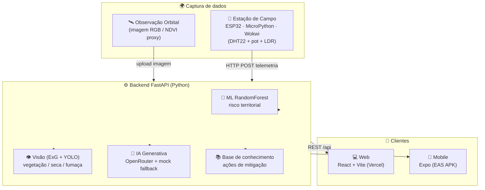

# FIAP - Faculdade de Informática e Administração Paulista

<p align="center">
<a href= "https://www.fiap.com.br/"></a>
</p>

<br>

# 🛰️ TerraVista — Earth Observation for Climate & Agricultural Resilience

## Global Solution 2026.1 (SUB GS) · Graduação ON em Inteligência Artificial

<!-- Tech stack — always accurate -->
<p align="center">
  
  
  
  
  
  
  
</p>

<!-- Live deploys — Web/API/IoT are live; APK badge stays "soon" until the EAS build exists (see docs/deploy.md) -->
<p align="center">
  <a href="https://2-tiaor-global-solution-sub-2026-1.vercel.app"></a>
  <a href="https://twotiaor-global-solution-sub-2026-1.onrender.com/docs"></a>
  <a href="https://expo.dev/accounts/gabemule/projects/terravista/builds/3ab21b76-ba40-4a2b-8c3a-02771dd9fff0"></a>
  <a href="https://wokwi.com/projects/466934430632875009"></a>
</p>

---

## 👨‍🎓 Integrante

- **Gabriel Mule** — RM 560586

---

## 📜 Descrição

**TerraVista** é uma prova de conceito (POC) para a pergunta da Global Solution 2026.1:

> *Como tecnologias avançadas de Inteligência Artificial e computação podem impulsionar a nova economia espacial e gerar impacto positivo na Terra?*

A resposta da TerraVista é uma plataforma de **Observação da Terra (Earth Observation)**
que funde **dados orbitais (índices de vegetação / NDVI)** com **estações de campo IoT
(ESP32)**, processados por IA, para dois objetivos complementares e de igual peso:

- 🌪️ **Prevenção de desastres** — detecção de risco de incêndio, seca e estresse
  hídrico do território a partir de telemetria e imagens.
- 🌱 **Proteção agrícola** — monitoramento do vigor da lavoura e alertas de manejo
  para produtores.

A economia espacial entra como o **vetor de dados**: sensoriamento remoto orbital
é a fonte primária que, combinada com sensores de borda e modelos de IA, vira
inteligência acionável em terra.

---

## 🔗 Links da entrega

| O quê                               | Link                                                            |
| ----------------------------------- | --------------------------------------------------------------- |
| 💻 **Web (Vercel)**                  | <https://2-tiaor-global-solution-sub-2026-1.vercel.app>         |
| ⚙️ **API / Swagger (Render)**        | <https://twotiaor-global-solution-sub-2026-1.onrender.com/docs> |
| 📱 **APK Android (EAS Build)**       | <https://expo.dev/accounts/gabemule/projects/terravista/builds/3ab21b76-ba40-4a2b-8c3a-02771dd9fff0> |
| 📡 **IoT (Wokwi · ESP32)**           | <https://wokwi.com/projects/466934430632875009>                 |
| 📦 **Repositório (GitHub)**          | <https://github.com/fiap-ai/2TIAOR-global-solution-sub-2026.1>  |
| 🎥 **Vídeo demonstrativo (YouTube)** | *(adicionar antes da entrega)*                                  |

> **Credenciais de demonstração:** `admin` / `terravista`.
> A API roda no plano Free do Render — a **primeira** requisição pode levar ~50s
> (cold start); depois fica ágil.

---

### ✅ Requisitos mínimos da GS atendidos

| Requisito da GS | Onde foi entregue na TerraVista |
|---|---|
| **IA Generativa** | Assistente de resiliência (civil + agro) via OpenRouter com fallback offline — [`backend/`](backend/) + telas de Chat ([web](web/) / [mobile](mobile/)) |
| **Visão Computacional** | Análise de cena RGB (índice de vegetação ExG / proxy de NDVI) + YOLO opcional — [`vision/`](vision/) |
| **Machine Learning** | RandomForest de risco territorial sobre dataset sintético + 3 reais validados — [`ml/`](ml/) |
| **Análise de dados / APIs / dashboards** | API FastAPI com 9 endpoints + dashboards de telemetria — [`backend/`](backend/) + [`web/`](web/) |
| **Sensores / ESP32 / Edge** | Estação MicroPython com scoring de risco na borda + Wokwi — [`iot/`](iot/) |
| **Aplicação mobile** | App React Native + Expo espelhando as telas web — [`mobile/`](mobile/) |
| **Vídeo demonstrativo (≤ 5 min)** | Roteiro em [`docs/video-script.md`](docs/video-script.md) |

---

## 🗺️ Arquitetura



> Diagramas detalhados (fluxo + sequência de uma request) em
> [`docs/architecture.md`](docs/architecture.md).

---

## 📸 Telas

Capturas reais rodando contra o backend.

### 💻 Web

| Dashboard | Predict |
|---|---|
|  |  |
| **Vision** | **Assistant** |
|  |  |

### 📱 Mobile (Expo)

| Dashboard | Predict |
|---|---|
|  |  |

### 📡 IoT (Wokwi · ESP32)

| CRITICAL (LED vermelho) | HEALTHY (LED verde) |
|---|---|
|  |  |

> Mais telas (Login, Knowledge, Vision/Chat mobile) e o passo a passo visual
> completo no [relatório técnico](docs/technical-report.md).

---

## 📁 Estrutura de pastas

```text
2TIAOR-global-solution-2/
├── backend/     # API FastAPI (9 endpoints) + coleção Bruno
├── ml/          # Gerador de dataset + treino RandomForest + notebook
├── vision/      # Analisador de cena (ExG/NDVI) + YOLO + amostras
├── web/         # App React + Vite + shadcn/ui (deploy Vercel)
├── mobile/      # App React Native + Expo (React Native Paper) — EAS
├── iot/         # Estação ESP32 MicroPython + diagrama Wokwi
├── docs/        # Arquitetura, relatório técnico, roteiro de vídeo
├── assets/      # Logo FIAP e mídia compartilhada
└── README.md    # Este arquivo
```

Cada módulo tem o seu próprio README com instruções específicas:

| Módulo | README |
|---|---|
| Backend (FastAPI) | [`backend/README.md`](backend/README.md) |
| Machine Learning | [`ml/README.md`](ml/README.md) |
| Visão Computacional | [`vision/README.md`](vision/README.md) |
| Web | [`web/README.md`](web/README.md) |
| Mobile | [`mobile/README.md`](mobile/README.md) |
| IoT (ESP32) | [`iot/README.md`](iot/README.md) |

---

## 🔧 Como executar

Pré-requisitos: **Python 3.11+**, **Node.js 18+** e, para o mobile, **Expo CLI**.

### 1. Backend (API) — base para tudo

```bash
cd backend
make setup                 # cria .venv e instala dependências
cp .env.example .env        # opcional: adicione sua chave OpenRouter
make dev                    # http://127.0.0.1:8000  (Swagger em /docs)
```

> O modelo de ML deve existir em `ml/models/terra_risk.joblib`.
> Caso não exista, rode `make train` dentro de `ml/`.

### 2. Web

```bash
cd web
npm install
npm run dev                 # http://localhost:5173
```

### 3. Mobile

```bash
cd mobile
npm install
npx expo start              # abra no Expo Go ou rode --web / --android
```

### 4. IoT (simulação)

Abra o projeto Wokwi em [`iot/`](iot/) — link e instruções no
[`iot/README.md`](iot/README.md).

**Credenciais de demonstração:** `admin` / `terravista`.

---

## 🛠️ Tecnologias utilizadas

- **Backend:** Python · FastAPI · Pydantic v2 · scikit-learn · Pillow
- **ML:** RandomForestClassifier (dataset sintético + UCI / Kaggle / NASA FIRMS)
- **Visão:** Índice de vegetação ExG (proxy de NDVI) · Ultralytics YOLO
- **IA Generativa:** OpenRouter (cadeia de fallback de 3 níveis + mock offline)
- **Web:** React · Vite · TypeScript · shadcn/ui · Recharts
- **Mobile:** React Native · Expo · React Native Paper · react-native-chart-kit
- **IoT:** MicroPython · ESP32 · DHT22 · LDR · LCD/LED · Wokwi

---

## 🗃️ Histórico de versões

- **1.0.0** — Entrega da Global Solution 2026.1 (SUB GS): plataforma full-stack
  completa (ML, visão, backend, IoT, web, mobile) + documentação.

---

## 📋 Licença

<p xmlns:cc="http://creativecommons.org/ns#" xmlns:dct="http://purl.org/dc/terms/"><a property="dct:title" rel="cc:attributionURL" href="https://github.com/SabrinaOtoni/TEMPLATE-FIAP-GRAD-ON-IA">MODELO GIT FIAP</a> por <a rel="cc:attributionURL dct:creator" property="cc:attributionName" href="https://fiap.com.br">FIAP</a> está licenciado sobre <a href="http://creativecommons.org/licenses/by/4.0/?ref=chooser-v1" target="_blank" rel="license noopener noreferrer" style="display:inline-block;">Attribution 4.0 International</a>.</p>
