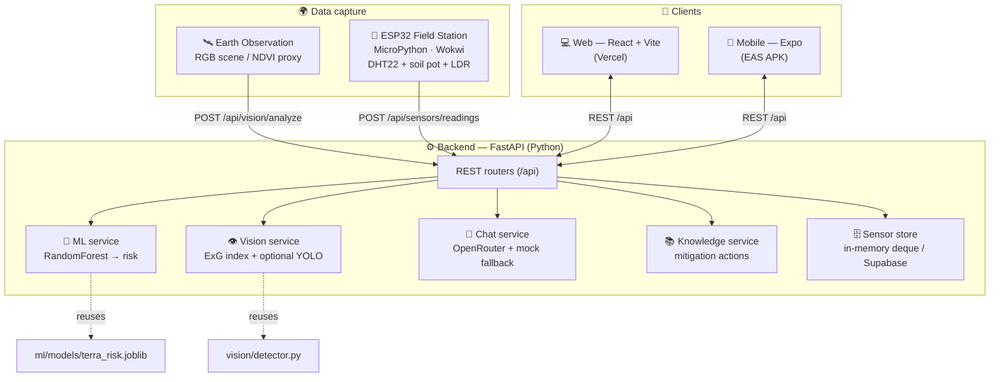
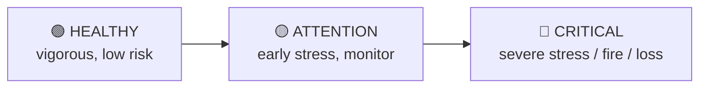
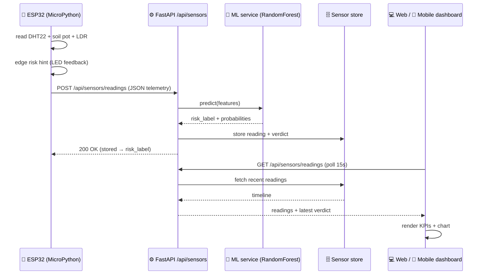
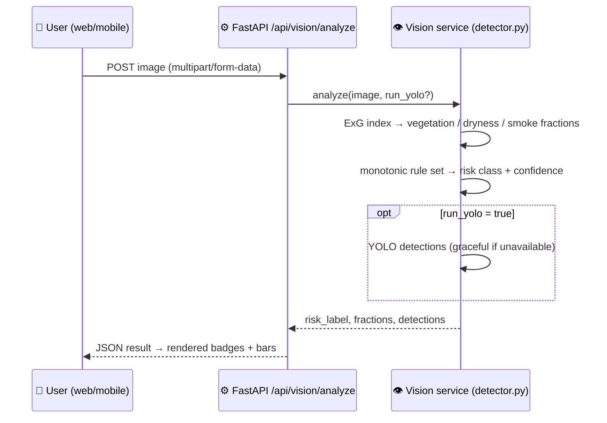
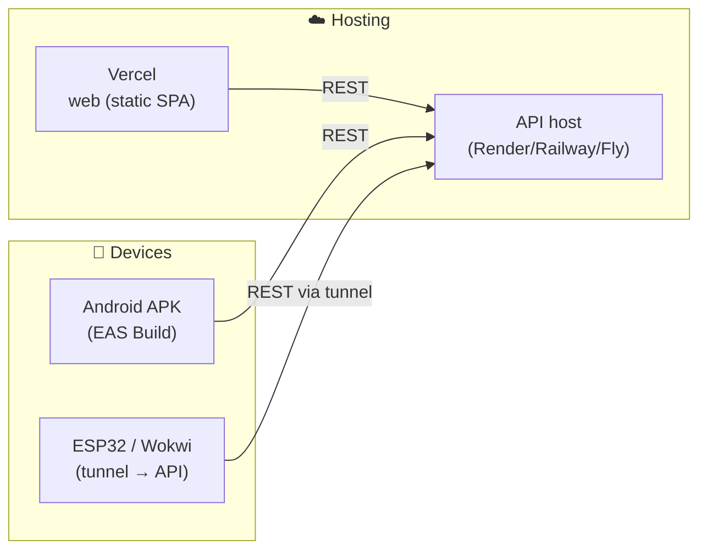

# TerraVista — Architecture

> Detailed architecture diagrams for the TerraVista platform.
> Author: Gabriel Mule (RM 560586)

TerraVista fuses **Earth-Observation imagery** and **IoT field telemetry** into a
single FastAPI backend that serves four AI capabilities (ML, computer vision,
generative AI, knowledge base) to a web and a mobile client. This document zooms
into the data flow and a representative request lifecycle.

---

## 1. System overview

**Key principle — no duplicated logic:** the backend imports the trained model
(`ml/models/terra_risk.joblib`) and the scene analyzer (`vision/detector.py`)
**by path**, so the served pipeline never diverges from what was trained/tested.

---

## 2. Module responsibilities

| Module | Responsibility | Key tech |
|---|---|---|
| `ml/` | Train the territorial-risk classifier on synthetic data validated against real datasets | RandomForest, scikit-learn |
| `vision/` | Classify an RGB scene (vegetation / dryness / smoke) + optional detection | ExG index, Ultralytics YOLO |
| `backend/` | REST API tying every capability together (9 endpoints) | FastAPI, Pydantic v2 |
| `iot/` | Edge field station: read sensors, edge-score, POST telemetry | MicroPython, ESP32, Wokwi |
| `web/` | Operator dashboard + tools (Predict, Vision, Chat, Knowledge) | React, Vite, shadcn/ui |
| `mobile/` | Same screens for field use | React Native, Expo, Paper |

---

## 3. Risk taxonomy (shared language)

Every capability speaks the **same 3-class taxonomy**, so tabular ML, computer
vision and the IoT edge all agree:

---

## 4. Request lifecycle — IoT reading → dashboard

This sequence shows the end-to-end path from the field station to the dashboard,
exercising the IoT edge, the ML model and the persistence layer.

---

## 5. Request lifecycle — Vision analysis

---

## 6. Deployment topology (target)

Deploy configs already exist (`web/vercel.json`, `mobile/eas.json`); the
step-by-step handoff guide lives in [`deploy.md`](deploy.md).
