# TerraVista — Relatório Técnico

**Global Solution 2026.1 (SUB GS) — Graduação ON em Inteligência Artificial · FIAP**

**Autor:** Gabriel Mule — **RM 560586**

> Este documento é a fonte do PDF único de entrega. Exporte-o de dentro da pasta
> `docs/` (para que os caminhos relativos das imagens resolvam):
>
> ```bash
> cd docs && pandoc technical-report.md --pdf-engine=xelatex -V lang=pt-BR \
>   -V geometry:margin=2.5cm -V mainfont="Arial Unicode MS" -V monofont="Menlo" \
>   -o terravista-technical-report.pdf
> ```
>
> Todos os trechos de código estão em texto (sem prints), conforme as regras da
> GS. Adicione o link do vídeo (YouTube não listado) e o link do repositório na
> §5 antes da exportação final.

---

## 1. Introdução

A economia espacial deixou de ser puramente científica: satélites hoje monitoram
o clima, apoiam segurança, viabilizam rastreamento global, auxiliam na prevenção
de desastres e produzem grandes volumes de dados usados por governos, empresas e
centros de pesquisa. O desafio da SUB GS 2026.1 pergunta:

> *Como tecnologias avançadas de Inteligência Artificial e computação podem
> impulsionar a nova economia espacial e gerar impacto positivo na Terra?*

A **TerraVista** responde com uma **plataforma de Observação da Terra (Earth
Observation, EO)** que funde dados orbitais (índices de vegetação / NDVI) com
**estações de campo IoT (ESP32)**, processados por IA, para entregar dois
resultados de igual peso:

- **Prevenção de desastres** — detecção de risco de incêndio, seca e estresse
  hídrico sobre um território a partir de telemetria e imagens.
- **Proteção agrícola** — monitoramento do vigor da lavoura e emissão de alertas
  de manejo para produtores.

A economia espacial é o **vetor de dados**: o sensoriamento remoto orbital é a
fonte primária que, combinada com sensores de borda e modelos de IA, vira
inteligência acionável em terra.

### 1.1 Objetivos

- Entregar um **MVP funcional** cobrindo os requisitos mínimos da GS: IA
  generativa, visão computacional, machine learning, análise de dados, APIs,
  dashboards e sensores/ESP32/Edge.
- Construí-lo **full-stack**: backend (FastAPI), ML (RandomForest), visão (ExG +
  YOLO), web (React), mobile (Expo), IoT (MicroPython/Wokwi).
- Documentar tudo: READMEs, diagrama de arquitetura, este relatório e um roteiro
  de vídeo.

---

## 2. Desenvolvimento

### 2.1 Visão geral da arquitetura

A TerraVista é organizada como módulos independentes integrados por um backend
FastAPI. O backend **reutiliza exatamente os artefatos treinados** dos módulos de
ML e visão (importados por caminho), de modo que o pipeline servido nunca diverge
do que foi treinado e testado.

```
Earth Observation (RGB/NDVI) + ESP32 Field Station
                  │ HTTP
                  ▼
          Backend FastAPI (Python)
     ├─► ML RandomForest   → risco territorial (desastre + agro)
     ├─► Vision (ExG+YOLO) → vegetação / seca / fumaça
     ├─► LLM (OpenRouter)  → assistente defesa civil + agronomia
     └─► Knowledge base    → ações de mitigação/manejo
                  ▼
     Web (React, Vercel) + Mobile (Expo, EAS APK)
```

Diagramas completos (visão de sistema + sequências de requisição) estão em
[`architecture.md`](architecture.md).

### 2.2 Taxonomia de risco compartilhada

Toda capacidade — ML tabular, visão computacional e a borda IoT — fala a mesma
linguagem de 3 classes:

| Classe | Rótulo | Significado |
|---|---|---|
| 0 | `HEALTHY` | parcela bem irrigada, vegetação vigorosa, baixo risco de fogo |
| 1 | `ATTENTION` | sinais iniciais de estresse, recomenda-se monitorar/irrigar |
| 2 | `CRITICAL` | estresse hídrico severo / alto risco de fogo / perda de safra |

### 2.3 Machine Learning (`ml/`)

Uma **estratégia híbrida de dados** mantém o MVP totalmente reprodutível ao mesmo
tempo em que o ancora na realidade: o modelo treina sobre um dataset **sintético
com semente fixa** cujos coeficientes são validados contra **datasets reais**
(checagem direcional de correlação).

- **Núcleo sintético:** `generator.py` (seed `42`) — coeficientes física e
  agronomicamente plausíveis; fonte única de verdade para features e classes.
- **Camada de dados reais (validada):** UCI Forest Fires (517 linhas), Kaggle
  Crop Recommendation (2200), NASA FIRMS focos ao vivo (787) — usados para EDA e
  calibração, não como rótulos de treino.

**Features → alvo:**

| Feature | Unidade | Domínio de origem |
|---|---|---|
| `air_temperature` | °C | estação de campo IoT |
| `air_humidity` | % | estação de campo IoT |
| `soil_moisture` | % | estação de campo IoT |
| `solar_radiation` | W/m² | estação de campo IoT |
| `ndvi` | 0–1 | Observação da Terra (satélite) |
| `days_since_rain` | dias | EO / meteorologia |
| `wind_speed` | km/h | estação de campo IoT |
| **`risk_class`** | 0/1/2 | risco combinado desastre + agro (alvo) |

**Modelo e avaliação:** `RandomForestClassifier(n_estimators=300, max_depth=12,
min_samples_leaf=5, class_weight="balanced", random_state=42)`, split
estratificado 80/20. A avaliação foca no **recall da classe CRITICAL** — o erro
mais caro é deixar passar uma parcela crítica (fogo/seca/perda não detectados).
Métricas de referência (seed 42): **recall(CRITICAL) ≈ 0,80**, **F1 macro ≈
0,69**, com `soil_moisture` e `ndvi` como principais fatores — coerente com o
desenho físico do gerador.

O modelo é serializado como um bundle para que o backend faça inferência sem
re-derivar metadados:

```python
{
    "model": RandomForestClassifier,   # estimador treinado
    "feature_columns": [...],          # ordenação exata das entradas
    "class_names": {0: "HEALTHY", 1: "ATTENTION", 2: "CRITICAL"},
    "version": "1.0.0",
}
```

### 2.4 Visão Computacional (`vision/`)

Duas camadas complementares, ambas consumidas por `/api/vision/analyze`:

1. **Análise de cena por índice de vegetação** (`detector.py`, autoral e
   offline). Calcula o **Excess Green Index** `ExG = 2g − r − b` a partir das
   coordenadas cromáticas por pixel — um proxy RGB de NDVI quando não há banda do
   infravermelho próximo — e deriva três frações interpretáveis:
   - `vegetation_fraction` (dossel vigoroso, `ExG > 0,06`)
   - `dryness_fraction` (solo nu/queimado avermelhado-amarronzado)
   - `smoke_fraction` (pixels cinza brilhantes e de baixa saturação)

   Um conjunto de regras monotônico e auditável mapeia essas frações para uma
   classe de risco.

2. **Detecção de objetos** (opcional, Ultralytics YOLO `yolov8n`) — sinaliza
   veículos, pessoas, barcos e aeronaves em imagens reais, e **degrada com
   elegância** para uma lista `detections` vazia se os pesos não estiverem
   disponíveis.

**Validação** nas cenas sintéticas seed-42 — as três classes corretas:

| Cena | Risco | Vegetação | Seca | Fumaça |
|---|---|---|---|---|
| healthy | HEALTHY | 0,956 | 0,021 | 0,000 |
| attention | ATTENTION | 0,515 | 0,241 | 0,000 |
| critical | CRITICAL | 0,267 | 0,381 | 0,066 |

O ExG é um índice consolidado (Woebbecke et al., 1995); usá-lo como proxy de NDVI
apenas com RGB é uma simplificação honesta e documentada para o MVP. A evolução
para NDVI real (bandas NIR) está descrita em
[`professionalization.md`](professionalization.md).

### 2.5 API Backend (`backend/`)

Serviço FastAPI expondo **9 endpoints** sob `/api`:

| Método | Rota | Finalidade |
|---|---|---|
| GET | `/api/health` | Liveness + disponibilidade do modelo |
| POST | `/api/auth/login` | Login mock → bearer token |
| POST | `/api/predict` | Classifica uma parcela a partir de 7 features |
| POST | `/api/vision/analyze` | Classifica uma cena RGB enviada |
| POST | `/api/chat` | Assistente de IA (OpenRouter, fallback mock) |
| POST | `/api/sensors/readings` | Armazena uma leitura ESP32 (auto-classificada) |
| GET | `/api/sensors/readings` | Lista leituras recentes |
| GET | `/api/sensors/latest` | Última leitura + veredito |
| GET | `/api/knowledge` | Ações de mitigação (opcional `?risk_label=`) |

O **assistente de chat degrada com elegância** através de uma cadeia de fallback
de 3 níveis para que a demo nunca quebre: (1) modelo primário gratuito, (2)
fallback pago barato caso o gratuito esteja com rate-limit/erro, (3) mock offline
determinístico ancorado na base de conhecimento. O campo `source` da resposta
informa qual nível respondeu.

A persistência de sensores usa por padrão uma deque em memória e migra de forma
transparente para o Supabase quando as variáveis de ambiente estão presentes — a
demo é autossuficiente nos dois casos.

### 2.6 Estação de Campo IoT (`iot/`)

ESP32 simulado (MicroPython, **Wokwi** — sem hardware físico) que lê sensores,
calcula uma dica de risco **na borda** (feedback por LED) e faz POST de cada
leitura para `/api/sensors/readings`, que a reclassifica com o modelo de ML
treinado.

| Feature do modelo | Origem na simulação | Origem no mundo real |
|---|---|---|
| `air_temperature` / `air_humidity` | DHT22 | DHT22 / SHT31 |
| `soil_moisture` | potenciômetro (proxy) | sonda capacitiva de solo |
| `solar_radiation` | LDR | piranômetro |
| `ndvi` / `days_since_rain` / `wind_speed` | proxies derivados | satélite / meteorologia / anemômetro |

Simulação ao vivo: <https://wokwi.com/projects/466934430632875009>. Um LCD 16×2
mostra o risco atual e as leituras principais; três LEDs (verde/amarelo/vermelho)
espelham o veredito HEALTHY/ATTENTION/CRITICAL.

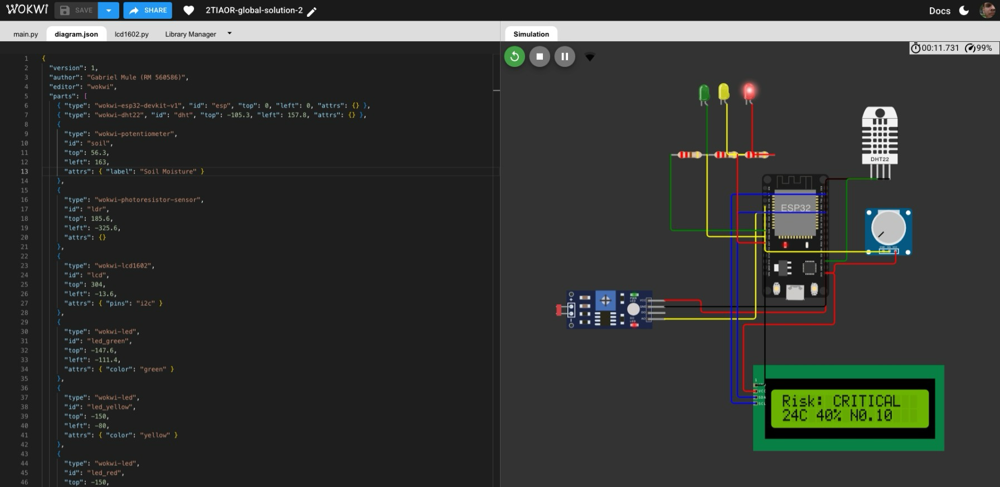
*Estação ESP32 na Wokwi — leituras de seca acionam o veredito CRITICAL na borda
(LED vermelho aceso) antes do POST para o backend.*

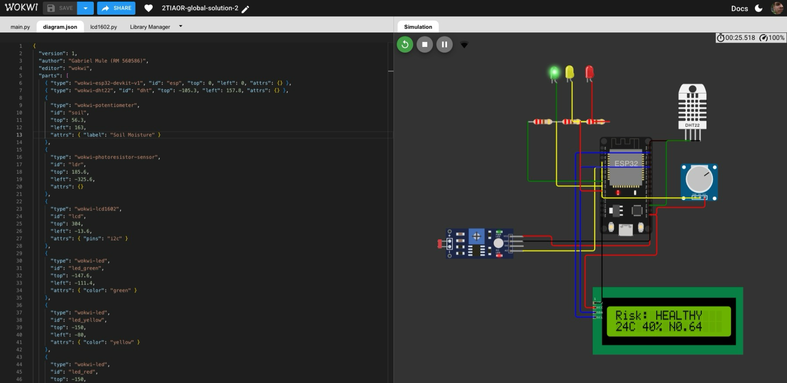
*A mesma estação com parcela bem irrigada — veredito HEALTHY na borda (LED verde
aceso).*

### 2.7 Clientes Web e Mobile

- **Web** (`web/`) — React + Vite + TypeScript + shadcn/ui, tema escuro. Páginas:
  Login, Dashboard (timeline Recharts + KPIs), Predict, Vision, Chat, Knowledge.
  Deploy via `vercel.json`.
- **Mobile** (`mobile/`) — React Native + Expo + React Native Paper, navegação em
  drawer, as mesmas seis telas. O Dashboard usa `react-native-chart-kit`; a
  Vision usa `expo-image-picker`; o Chat renderiza markdown com uma lista que se
  fixa ao final. APK via EAS (`eas.json`).

Ambos os clientes compartilham uma camada de API tipada e enxuta e a mesma
linguagem de cores de risco. As capturas abaixo são do app mobile rodando contra
o mesmo backend.

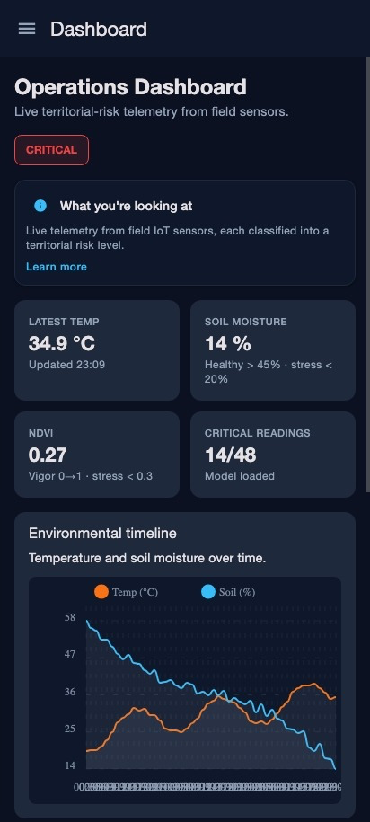
*Mobile — Dashboard com KPIs (34,9 °C / 14% / NDVI 0,27) e timeline de telemetria
(`react-native-chart-kit`).*

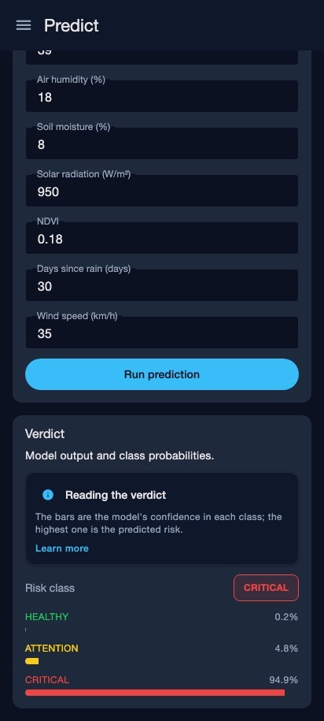
*Mobile — Predict com veredito CRITICAL (94,9%) a partir das 7 features da
parcela.*

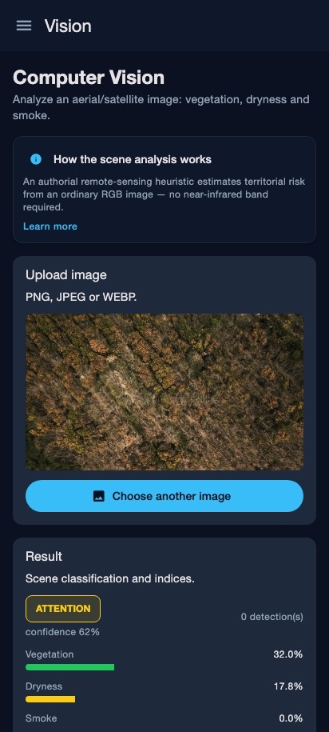
*Mobile — Vision classificando uma cena enviada como ATTENTION (62%) via índice
ExG.*

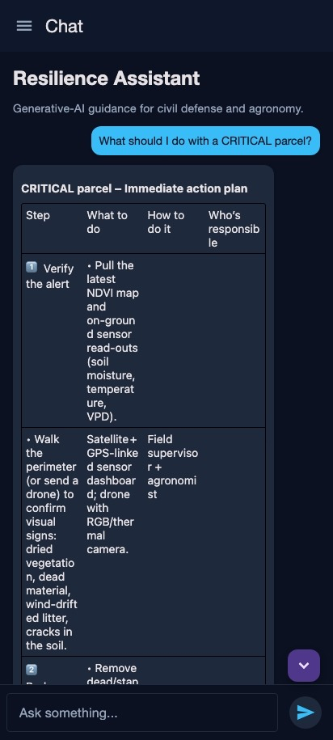
*Mobile — Assistente de Resiliência entregando um plano de ação para uma parcela
CRITICAL.*

### 2.8 Passo a passo da interface web

As capturas abaixo foram obtidas ao vivo do cliente web rodando contra o backend,
ilustrando cada capacidade de ponta a ponta.

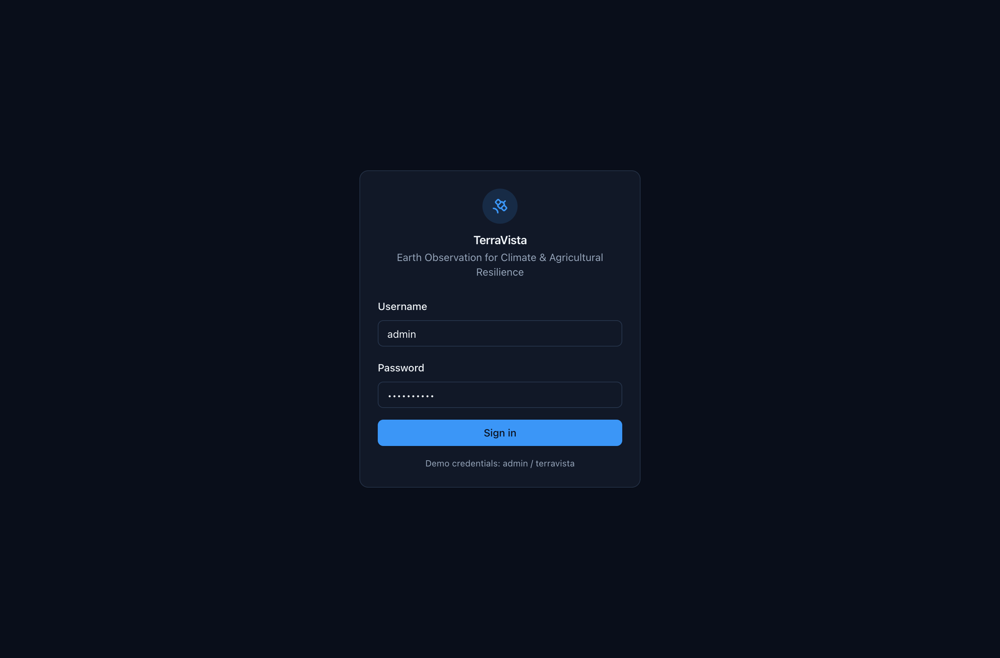
*Login — autenticação mock por bearer token protegendo o console do operador.*

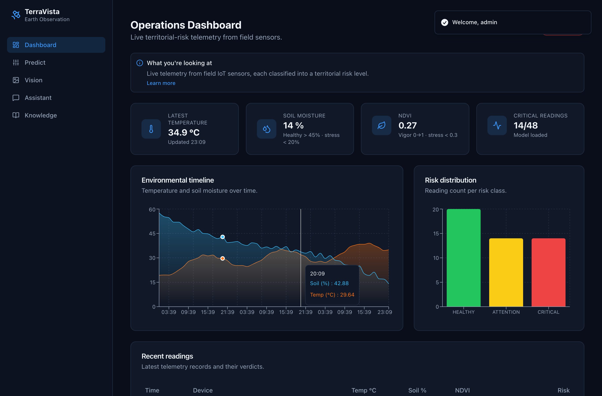
*Dashboard — KPIs e uma timeline de telemetria (Recharts) derivando de HEALTHY →
CRITICAL, alimentada pelo armazenamento de sensores.*

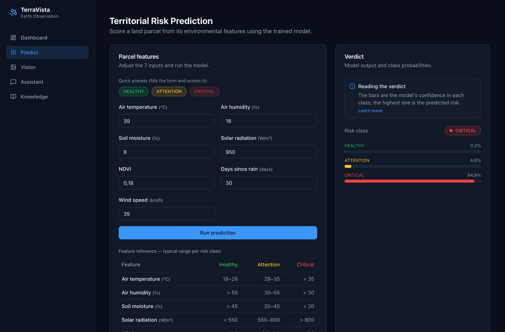
*Predict — uma parcela classificada como CRITICAL (≈94,9%) a partir das suas 7
features.*

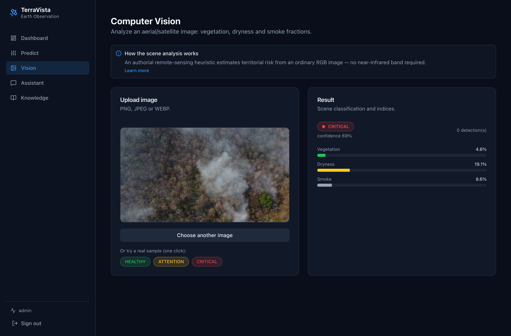
*Vision — uma cena de incêndio enviada e classificada como CRITICAL via índice
ExG.*

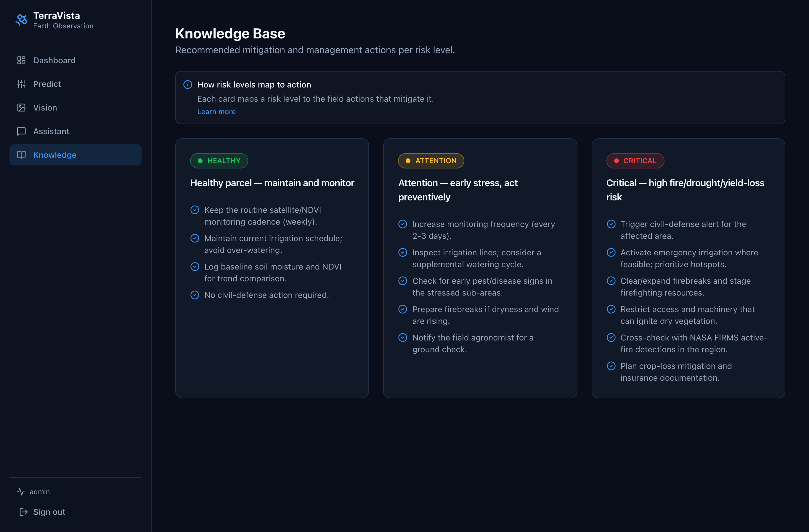
*Base de conhecimento — ações de mitigação/manejo por nível de risco.*

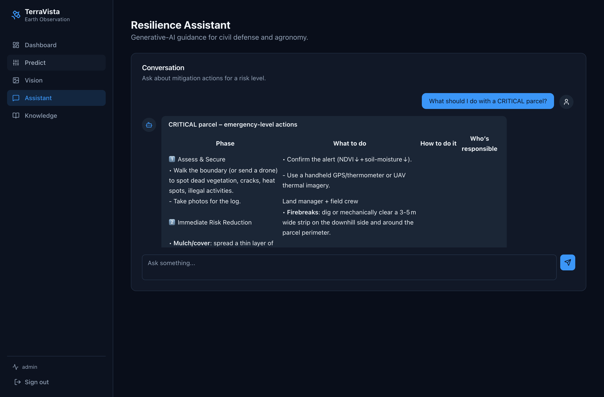
*Assistente de Resiliência — uma resposta ao vivo do OpenRouter com um plano de
ação para uma parcela CRITICAL.*

### 2.9 Principais decisões de projeto (ADRs)

- **Sem lógica duplicada:** o backend importa os artefatos de ML/visão por
  caminho.
- **ML com recall em primeiro lugar:** uma parcela CRITICAL não detectada é o
  erro mais caro.
- **Chat capaz de operar offline:** fallback de 3 níveis (gratuito → pago →
  mock).
- **Reprodutibilidade:** semente fixa `42` → dataset e modelo idênticos a cada
  execução.
- **Simplificações honestas:** ExG como proxy RGB de NDVI; armazenamento em
  memória; autenticação mock — todas documentadas com um caminho de evolução para
  produção.

---

## 3. Resultados Esperados

- **Prevenção de desastres:** identificação precoce de parcelas de alto risco
  (fogo / seca) a partir da fusão de telemetria + imagens, exibida em um dashboard
  ao vivo com vereditos por cor e orientações de mitigação geradas por IA.
- **Proteção agrícola:** monitoramento contínuo do vigor da lavoura e alertas de
  manejo, ajudando a reduzir a perda de safra.
- **MVP demonstrável:** todos os requisitos mínimos da GS são exercitados de ponta
  a ponta — IA generativa (chat), visão computacional (análise de cena), ML
  (classificador de risco), dados/APIs/dashboards (FastAPI + web/mobile) e
  sensores/ESP32/Edge (estação Wokwi). Métricas de referência: recall(CRITICAL) ≈
  0,80; visão 3/3 cenas corretas.

---

## 4. Conclusões

A TerraVista mostra como dados da economia espacial — Observação da Terra orbital
— combinados com IoT de borda e IA acessível podem produzir impacto terrestre
tangível tanto em prevenção de desastres quanto em agricultura, usando um MVP
reprodutível e totalmente testável. A arquitetura é deliberadamente modular e
honesta quanto às suas simplificações, cada uma acompanhada de um caminho
documentado rumo a hardware profissional e dados de satélite reais (ver
[`professionalization.md`](professionalization.md)). O resultado é uma prova de
conceito coerente e de ponta a ponta, que mapeia diretamente os critérios de
avaliação da GS ao mesmo tempo em que se mantém como uma base crível para um
sistema de produção.

---

## 5. Referências e Links

- **Repositório:** *(adicionar o link público do repositório antes da entrega)*
- **Vídeo demonstrativo (YouTube não listado):** *(adicionar o link antes da
  entrega)*
- **Simulação IoT ao vivo:** <https://wokwi.com/projects/466934430632875009>
- Woebbecke, D. M. et al. (1995). *Color indices for weed identification.* — base
  para o Excess Green Index (ExG).
- Fontes de dados: UCI Forest Fires, Kaggle Crop Recommendation, NASA FIRMS.
